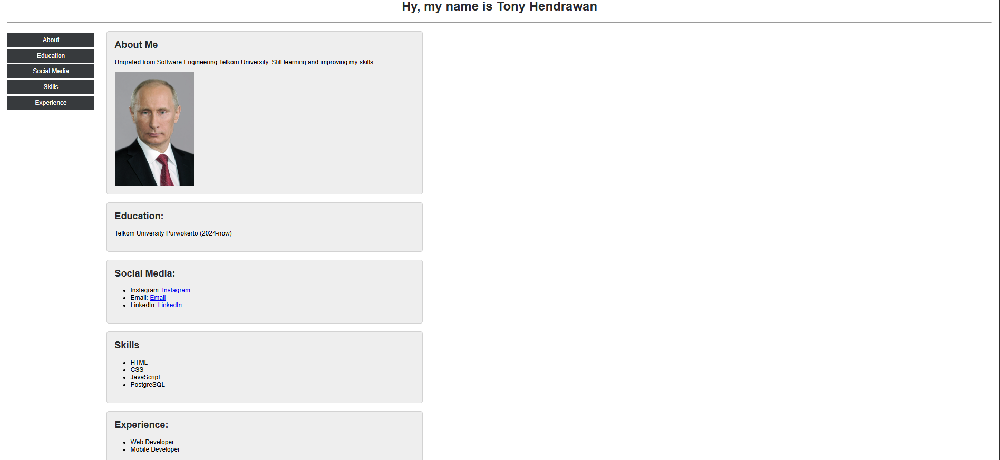

  <strong>Tony Hendrawan</strong>

  

## Identitas

<table align="center">
  <tr>
    <td><strong>Nama</strong></td>
    <td>Tony Hendrawan</td>
  </tr>
  <tr>
    <td><strong>NIM</strong></td>
    <td>103122400021</td>
  </tr>
  <tr>
    <td><strong>Kelas</strong></td>
    <td>SE-08-01</td>
  </tr>
  <tr>
    <td>Pengembangan dan Perancangan Web</td>
  </tr>
  <tr>
    <td>Telkom University Purwokerto</td>
  </tr>
</table>

 

## Cover

  <strong>LAPORAN PRAKTIKUM PENGEMBANGAN DAN PERANCANGAN WEB</strong>

  CV Sederhana Menggunakan HTML dan CSS

## Identitas Praktikum

- **Pertemuan:** Week 3
- **Topik:** Pembuatan CV HTML dan CSS

## Source Code

- [HTML (`index.html`)](../Source%20Code/index.html)
- [CSS (`style.css`)](../Source%20Code/style.css)

## Output

  

